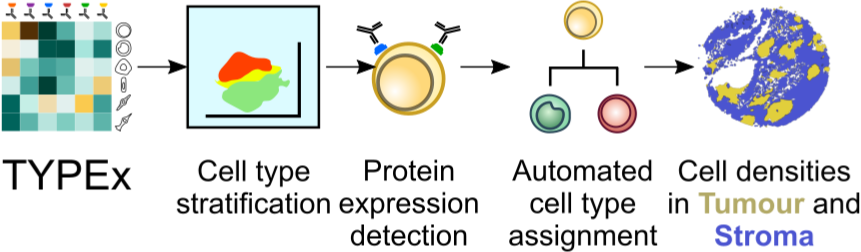

.. _TYPEx_anchor: 

|workflow| 

TYPEx uses multiplexed imaging to detect protein expression on single cells, annotate cell types automatically based on user-provided definitions and quantify cell densities per tissue area. It can be customised with input parameters and configuration files, allowing it to perform an end-to-end cell phenotyping analysis without the need for manual adjustments. 

Usage
=============

.. code-block:: bash
    
    nextflow run TYPEx/main.nf -profile singularity \
	-c TYPEx/nextflow.config \
	--inDir "$PWD/results/" \
	--sampleFile "$PWD/TYPEx/data/sample_data.tracerx.txt" \
	--release "TYPEx_test" \
	--outDir "$PWD/results/TYPEx/$release/" \
	--paramsConfig "$PWD/TYPEx/data/typing_params.json" \
	--annotationConfig "PWD/TYPEx/data/cell_type_annotation.p1.json" \
        --inputTable "$PWD/data/cell_objects.tracerx.txt"

Input Files
==================

The minimal input for TYPEx is a matrix of cell intensities for each protein and a file with cell definitions specific to the user’s antibody panel.

#. *Input table* - The input matrix has values that summarise the intensity of a protein per cell object, such as mean intensity, independently of the imaging modality or antibody tagging technique.

================= ============ ===== ===== ========= ============ ============ ============
  Cell Object ID    Image ID     X     Y      Area     Marker 1     ...          Marker N  
================= ============ ===== ===== ========= ============ ============ ============

Area is optional and can be populated with NAs.

#. *cell_type_annotation.json* The cell-type definitions file includes a list of cell lineages and the corresponding marker proteins that together can be used to identify a cell lineage. When designing this file it is important to ensure that each cell in the cohort can be covered by these definitions. Some markers, such as CD45 and Vimentin, are expressed by multiple cell lineages. These shared proteins are used to infer a hierarchy of cell lineages, which is later considered for cell stratification and annotation. An example of a cell-type definitions file is shown below for TRACERx analyses, where we defined 13 major cell types targeted by our two antibody panels, while ensuring that each cell in the cohort can be covered by these definitions. 

#. *typing_params.json* - settings for which clustering approaches to use and which set of markers

* magnitude 
As CellAssign was developed for single-cell sequencing read count data, the input protein intensity matrix should be rescaled to a range of 0 - 10^6 using the input parameter magnitude. 

* batch_effects
CellAssign also accounts for batch effects, which can be considered if provided in a sample-annotation table and specified as input parameters to TYPEx for batch correction.

#. Table with sample annotations

============ ================== ======= ===================
  Image ID     Batch effect 1     ...     Batch effect N  
============ ================== ======= ===================

Input paramters
==================

* clustering method <FastPG,Rphenograph,flowSOM>
* run ID: panel name, imcyto run [opt], study name

Optional
* most frequent cell type - if provided the longest process will be run in parallel

Within tissue_segmentation.json, where annotations of tissue can be overlaid and quantified.

The workflow can be specified with tree logical variables:
- stratify_by_confidence
- clustering only - perform clusering without any stratifications
- subsampling - perfom subsampling analysis of clustering tools

 
Outputs
=============

TYPEx outputs summary tables that can be readily interrogated for biological questions. These include densities of identified cell phenotypes, a catalogue of the expressed proteins and combinations thereof, quantified across the whole tissue area or within each tissue compartment. These outputs are generated by four analytical steps: cell stratification, detection of protein expression, and automated cell annotation, followed by a quantitative summary per tissue compartment.

All outputs are saved in the outputDirectory/summary folder.
- cell objects
- phenotypes
- cell densities total and per tissue category

Troubleshooting
=============

Several visualisation plots are output for each step in the workflow and can be used to make sure each step has gone as expected.
